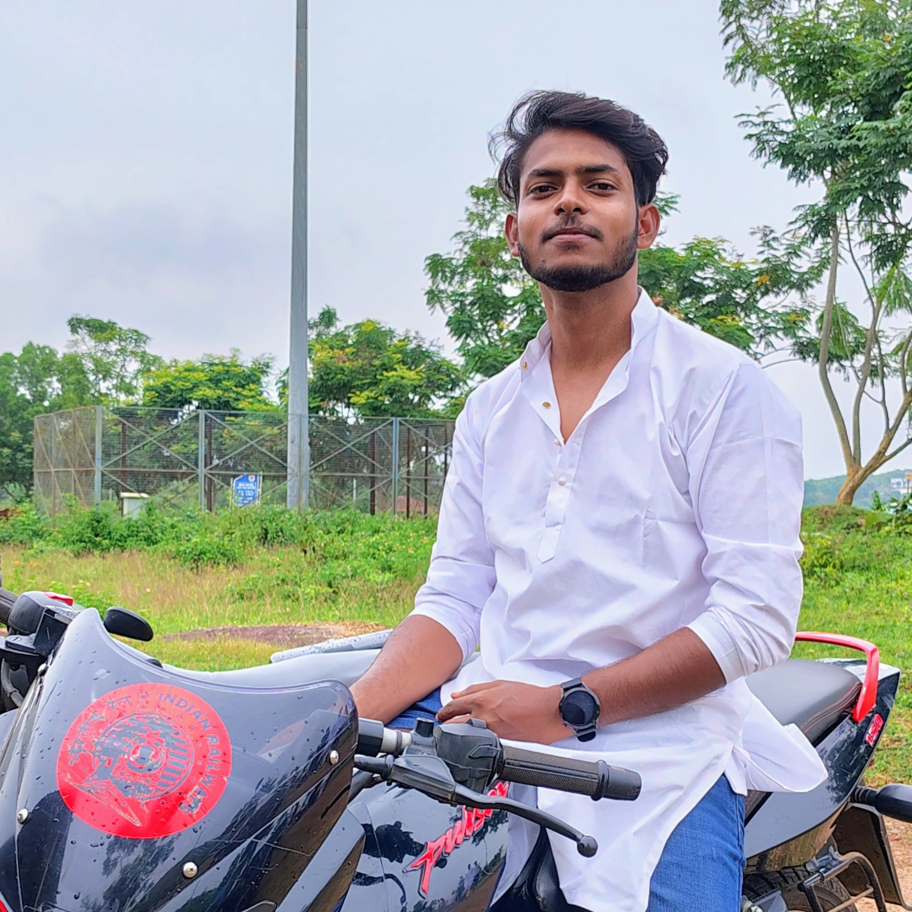

# thechief08.github.io
Portfolio 

<html lang="en">
<head>
  <meta charset="UTF-8" />
  <meta name="viewport" content="width=device-width, initial-scale=1.0" />
  
  <link rel="stylesheet" href="style.css" />
  <link rel="stylesheet" href="https://cdnjs.cloudflare.com/ajax/libs/font-awesome/6.5.0/css/all.min.css">
</head>
<body>
  <header>
    <h1>Joshua Abhijeet Amos</h1>
    
🎬 Video Editor | Creative Storyteller |

    <nav>
      <a href="#about">Home</a>
      <a href="#resume">Resume</a>
      <a href="#contact">Contact</a>
    </nav>
  </header>

  <section id="about">
    
    

      <h2>About Me</h2>
      

        I’m a passionate video editor. I recently completed my master's in Journalism and Mass Communication
        at the Central University of Odisha. I bring stories to life through seamless transitions, rhythm,
        and creativity. I believe video is the most powerful way to inspire and engage audiences.
      

    

  </section>

  <section id="resume">
    <h2>Resume</h2>
    
Download my portfolio resume below:

    <a href="JOSHUACV.pdf" download class="button">📄 Download Resume (PDF)</a>
  </section>

  <section id="contact">
    <h2>Contact Me</h2>
    
📞 8969385356

    
📧 joshuaamos137@gmail.com

https://www.instagram.com/the_chief_08/
  </section>

  

  <footer>
    
&copy; 2025 Joshua Abhijeet Amos. All rights reserved.

    
      
  </footer>
</body>
</html>
